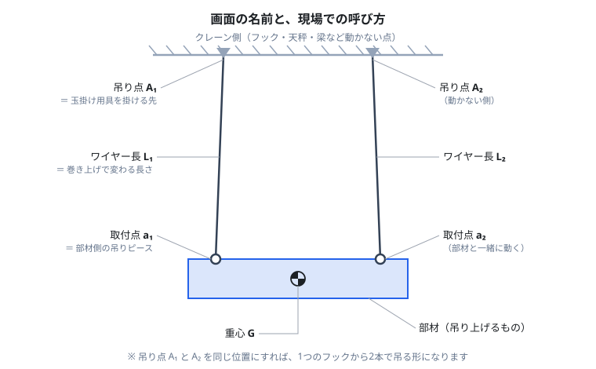
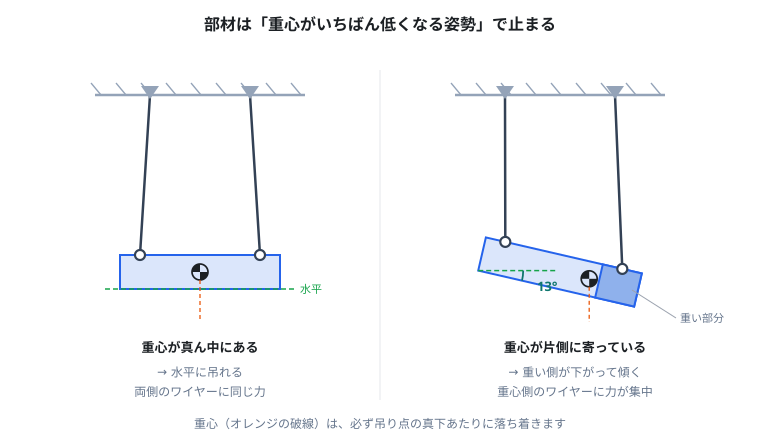
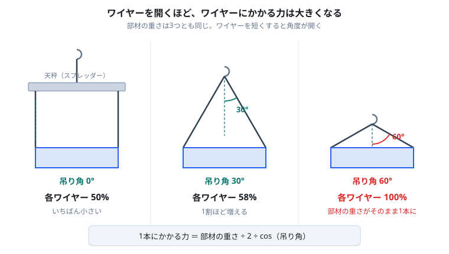
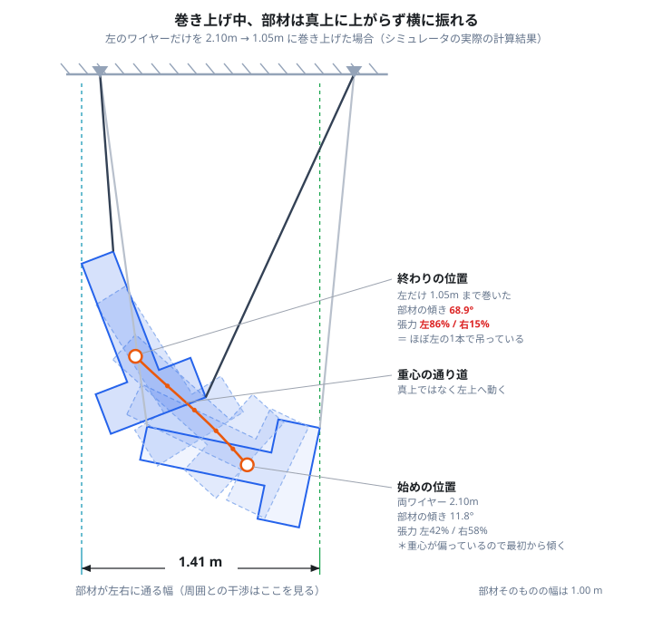

# 2点吊りシミュレーション

部材を2本のワイヤーで吊り上げるとき、**どう傾くか・どこまで横に振れるか・どちらのワイヤーに力が寄るか**を、作業前にパソコン上で確認するツールです。

`two-point-2d.html` をダブルクリックしてブラウザで開くだけで動きます。インストールもインターネット接続も不要です。

---

## 何のためのツールか

吊り上げの前に、こんなことを事前に確かめられます。

| 現場での心配ごと | このツールで見るもの |
|---|---|
| 部材は水平に吊れるか。何度傾くか | 傾き（角度）の表示 |
| ワイヤー1本に何トン掛かるか | 部材の重量を入れて張力を確認（kN / tf / kgf） |
| どちらのワイヤーに力が寄るか | 張力の表示（％でも表示） |
| 巻き上げ中に部材が柱や壁に当たらないか | 掃引形状・左右変位のグラフ |
| ワイヤーの長さをどう調整すれば水平になるか | ワイヤー長を変えて試す |
| 片方だけ巻き上げたとき、もう片方が緩まないか | ワイヤーの張り／たるみ表示 |

> **注意**
> このツールは検討の補助です。実際の玉掛け作業は、必ず法令・社内基準・有資格者の判断に従ってください。

---

## まず、言葉の対応

画面に出てくる名前と、現場での呼び方の対応です。



| 画面の名前 | 現場でいうと | 動くか |
|---|---|---|
| **吊り点 A₁ / A₂** | クレーンのフック、天秤、梁など、玉掛け用具を掛ける先 | 動かない |
| **ワイヤー長 L₁ / L₂** | ワイヤーの長さ。巻き上げるとこれが短くなる | 変わる |
| **取付点 a₁ / a₂** | 部材側の吊りピース、吊り金具 | 部材と一緒に動く |
| **重心 G** | 部材の重心 | 部材と一緒に動く |

1つのフックから2本で吊る場合は、**吊り点 A₁ と A₂ を同じ位置**にしてください。

---

## 確認できること

### 1. 部材は水平に吊れるか

部材は必ず「**重心がいちばん低くなる姿勢**」で止まります。重心が真ん中になければ、重い側が下がって傾きます。



画面では次のように出ます。

- **姿勢 θ** — 部材そのものの傾き
- **取付点線 a₁→a₂** — 2つの吊りピースを結んだ線の傾き

吊りピースの高さが左右で違う部材だと、この2つは一致しません。**水平に吊れているかを見るのは「取付点線」のほう**です。

水平にしたいときは、ワイヤー長 L₁ / L₂ を変えて、傾きが 0° に近づくところを探します。

### 2. どちらのワイヤーに力が寄るか

ワイヤーを開くほど、1本あたりにかかる力は大きくなります。



| 吊り角 | ワイヤー1本にかかる力 |
|---|---|
| 0°（天秤を使う） | 部材の重さの 50% |
| 30° | 58% |
| 45° | 71% |
| **60°** | **100%（部材の重さがそのまま1本に）** |

さらに、**重心が偏っていると左右で力が違います**。画面の「張力 T₁ / T₂」で両方の値を確認できます。

#### 部材の重量を入れる

「部材の重量」に実際の重さを入れると、**張力がそのまま実際の値で出ます**。手計算での換算は不要です。

- 重量の単位：**kg / t**（1 kg 〜 2000 t 程度まで）
- 張力の単位：**kN / tf / kgf / N**

例：12 t の部材を、片方だけ巻き上げた状態

```
部材の重さ（＝両ワイヤーの合計）   12.00 tf（12.000 t）
張力 T₁                      10.36 tf (86%)
張力 T₂                      1.841 tf (15%)
```

カッコ内の **%は全体重量に対する割合**です。重量を変えても割合は変わらないので、玉掛け用具の選定は tf の値、荷重の偏りの把握は % を見る、という使い分けができます。

> 重量は**張力の表示にだけ**効きます。部材がどう傾くか・どこまで振れるかは重量によらず同じです（重さが倍になれば回りにくさも倍になり、釣り合うため）。1 t でも 2000 t でも、止まる位置は同じになることを確認しています。

### 3. 巻き上げ中にどこまで振れるか

**部材は真上には上がりません。** 特に片方だけ巻き上げると、回転しながら大きく横に動きます。



上の例では、部材の幅は 1.00 m なのに、**通過する幅は 1.41 m** あります。柱や既設物とのクリアランスは、部材の幅ではなくこの掃引幅で見る必要があります。

また張力も、開始時の 42% / 58% から、終了時には **86% / 15%** まで偏ります。ほぼ片方のワイヤー1本で吊っている状態です。

画面では次の形で確認できます。

- **掃引形状** — 手順全体で部材が通過した範囲を薄い青で塗る
- **掃引の限界線** — いちばん左・いちばん右に到達する位置を破線で表示
- **左右変位のグラフ** — 各点が開始位置から左右にどれだけ動いたか

### 4. ワイヤーが緩まないか

片方だけ巻き上げていくと、もう片方の張力が減っていき、やがて **0 になって緩みます**。緩んだ瞬間に部材は1本吊りになり、大きく振れます。

画面では、緩んだワイヤーは**たるんだ曲線**で描かれ、状態表示が「片方たるみ」に変わります。グラフでは張力が 0 に達する時刻に縦線が入ります。

---

## 使い方

### 手順1：部材の形を決める

「形状」から選ぶか、CAD図面（DXF）を読み込みます（後述）。

プリセットには「一様な長方形板」「L字型」「長方形＋右端に錘」「三角形」「細長い棒」があります。重心は形から自動で計算されます。

### 手順2：吊り点と取付点を入れる

- **吊り点 A（天井側）** — クレーン側の座標を入力
- **取付点 a（物体側）** — 部材のどこに吊りピースが付くかを入力

数値入力のほか、画面上でドラッグしても動かせます（どちらも連動します）。取付点は「a₁ を頂点へ」ボタンで部材の角にぴったり合わせられます。

### 手順3：部材の重量を入れる

「部材の重量」に実重量を入力し、単位（kg / t）と張力の表示単位（kN / tf / kgf / N）を選びます。

すぐ下に「部材の重さ（＝両ワイヤーの合計）」が出るので、**桁を間違えていないかここで確認**してください。単位を切り替えると、入力欄の数字はその単位の値として読み直されます（`2.5` + `t` なら 2.5 t）。

### 手順4：巻き上げ手順を組む

「ステップ（巻き上げ手順）」の表に、**各段階で到達させたいワイヤー長**を書きます。

| # | L₁ | L₂ | 速度 | 待ち |
|---|---|---|---|---|
| 0 | 2.10 | 2.10 | 初期 | 1.0 |
| 1 | 1.50 | 1.50 | 0.08 | 2.0 |
| 2 | 1.05 | 1.50 | 0.06 | 2.0 |

- **ステップ0** が開始状態（吊り上げ前の長さ）
- 速度は「動きの大きいほうのワイヤー」の速度。両方が同時に到達するよう自動で配分されます
- 待ちは、到達後に揺れが収まるのを待つ時間

**▶ 再生**で通し実行、**⏭ 次のステップ**で1段階ずつ確認できます。

### 手順5：結果を読む

画面右の「現在の状態」に、その瞬間の値が出ます。

```
状態                    2本とも張る
重心高さ y_G             1.9337 m
姿勢 θ                  -68.94°
糸の傾き（鉛直から）        +4.25° / -24.66°
糸のなす角（開き）          28.91°
取付点線 a₁→a₂（水平から）  -57.63°
張力 T₁                 10.36 tf (86%)
張力 T₂                 1.841 tf (15%)
部材の重量               12.000 t
```

この例では **姿勢 θ が −68.94°、取付点線が −57.63°** と 11.31° ずれています。これは吊りピース a₁ と a₂ の高さが部材上で違うためです。**水平に吊れているかを判断するのは取付点線のほう**、という先ほどの話がそのまま出ています。

下段のグラフは、右のセレクタで切り替えられます。

| グラフ | 読みたいこと |
|---|---|
| 巻き上げ経路：重心の座標 | 重心が上下左右にどう動くか |
| 巻き上げ経路：左右端の x 座標 | 部材のいちばん左・右がどこまで行くか |
| **巻き上げ経路：初期位置からの左右変位** | 各点が開始位置から左右に何m動くか |
| **巻き上げ経路：糸と取付点線の角度** | 途中でどこまで傾くか・ワイヤーが何度開くか |
| **巻き上げ経路：糸の張力** | どの時点でどちらに力が寄るか |
| φ曲線（ポテンシャル） | どこで安定するかの理屈（詳しい人向け） |

---

## CAD図面（DXF）から読み込む

実際の部材形状を使いたい場合、CADから **ASCII形式のDXF** で書き出して読み込めます。

### 図面の描き方

レイヤーを3つに分けてください。名前は自由です。

| レイヤー | 描くもの |
|---|---|
| 外形 | 部材の輪郭。**閉じたポリライン**（線分や円弧で描く場合は端点をきちんと繋ぐ） |
| 糸 | **ちょうど2本の線分**。上側の端点が吊り点、下側が取付点になります |
| 重心（任意） | 点を1つ。省略すると外形から自動計算します |

### 読み込み手順

1. 「DXFを選択…」でファイルを開く
2. レイヤー一覧が出るので、それぞれの役割をプルダウンで指定（`外形` `糸` `重心` などの名前は自動判定されます）
3. **単位**を確認（初期値は m。図面が mm ならプルダウンで切り替え）
4. 「反映」を押す

単位は**読み込んだ後でも切り替えられます**。切り替えると、組んだ手順もそのまま換算されます。

円弧、bulge（膨らみ）付きポリライン、円にも対応しています。DWG は読めないので、CAD側でDXFに書き出してください。ブロック参照（INSERT）は分解してから書き出してください。

---

## このツールの前提と限界

作業計画に使う前に、必ず目を通してください。

- **2次元（真横から見た断面）だけ**を扱います。手前や奥へ振れる動きは計算していません。
- **ワイヤーは伸びない・重さゼロ**として扱います。実際のワイヤーの伸びやたるみは反映されません。
- **当たり判定はありません。** ワイヤーが部材を突き抜けるような姿勢も、計算上は解として出てきます。図を見て、現実にあり得るかは人が判断してください。
- **重量は張力の表示にだけ**効きます。傾きや振れ幅は重量によらず同じです。
- **急な加減速による衝撃荷重**は扱っていません。表示される張力は、ゆっくり吊った場合の静的な値が基本です。
- 落ち着く姿勢が**複数ある**場合があります（画面に「局所極小」と表示されます）。実際にどれになるかは、吊り始めの状態によって変わります。

---

## ファイル構成

| ファイル | 内容 |
|---|---|
| `two-point-2d.html` | シミュレータ本体。これ1つで動きます |
| `sample.dxf` | DXF読み込みの動作確認用サンプル図面 |
| `docs/*.svg` | このREADMEの図 |

---

## 技術的な補足

興味のある方向けの中身の説明です。使うだけなら読む必要はありません。

- **動力学** — XPBD（位置ベースの拘束解法）による2次元剛体シミュレーション。ワイヤーは片側拘束（引く力しか出せない）として扱い、減衰を入れて静止させます。
- **つり合い解の探索** — ワイヤー2本が張った状態は四節リンクと等価で、残る自由度は1つ。その1パラメータに沿って重心高さの局所極小をすべて数え上げ、各点で静的つり合いを解いて張力が負になる（＝ワイヤーが押す必要がある）解を除外しています。極小位置は放物線補間で細分化しており、動力学の収束先と 10⁻⁷ m 台で一致します。
- **巻き上げ経路** — 手順に沿ってワイヤー長を変えながら、直前の解にいちばん近いつり合い解を追う連続法。ワイヤーが緩む／張り直すモード遷移もこの過程で自動的に検出されます。
- **掃引形状** — 経路上の各姿勢の多角形をオフスクリーンに重ねて塗り、その和集合のシルエットを表示しています。
