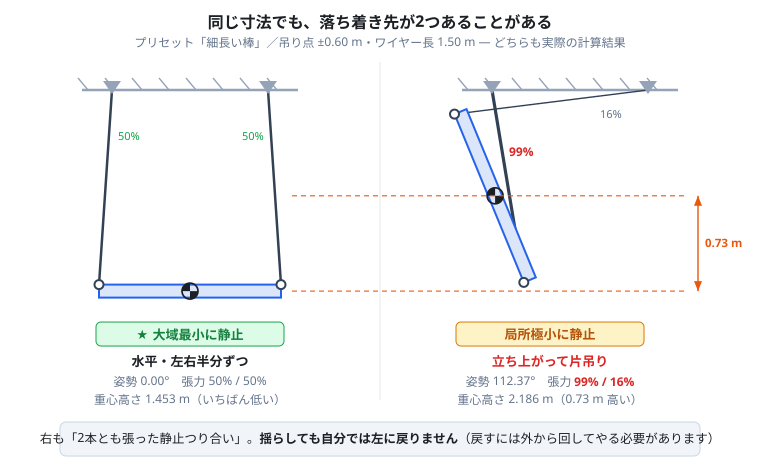

# 2点吊りシミュレーション

部材を2本のワイヤーで吊り上げるとき、**どう傾くか・どこまで横に振れるか・どちらのワイヤーに力が寄るか**を、作業前にパソコン上で確認するツールです。

`two-point-2d.html` をダブルクリックしてブラウザで開くだけで動きます。インストールもインターネット接続も不要です。

---

## 何のためのツールか

吊り上げの前に、こんなことを事前に確かめられます。

| 現場での心配ごと | このツールで見るもの |
|---|---|
| 部材は水平に吊れるか。何度傾くか | 傾き（角度）の表示 |
| ワイヤー1本に何トン掛かるか | 部材の重量を入れて張力を確認（kN / tf / kgf） |
| どちらのワイヤーに力が寄るか | 張力の表示（％でも表示） |
| 巻き上げ中に部材が柱や壁に当たらないか | 掃引形状・左右変位のグラフ |
| ワイヤーの長さをどう調整すれば水平になるか | ワイヤー長を変えて試す |
| 片方だけ巻き上げたとき、もう片方が緩まないか | ワイヤーの張り／たるみ表示 |

> **注意**
> このツールは検討の補助です。実際の玉掛け作業は、必ず法令・社内基準・有資格者の判断に従ってください。

---

## まず、言葉の対応

画面に出てくる名前と、現場での呼び方の対応です。


| 画面の名前 | 現場でいうと | 動くか |
|---|---|---|
| **吊り点 A₁ / A₂** | クレーンのフック、天秤、梁など、玉掛け用具を掛ける先 | 動かない |
| **ワイヤー長 L₁ / L₂** | ワイヤーの長さ。巻き上げるとこれが短くなる | 変わる |
| **取付点 a₁ / a₂** | 部材側の吊りピース、吊り金具 | 部材と一緒に動く |
| **重心 G** | 部材の重心 | 部材と一緒に動く |

1つのフックから2本で吊る場合は、**吊り点 A₁ と A₂ を同じ位置**にしてください。逆に、部材側の吊りピースが1つで、そこに2本を掛ける場合は**取付点 a₁ と a₂ を同じ位置**にします（画面の表示が「1点吊り」に変わり、部材はその点を支点に、重心が真下に来る姿勢で止まります）。

---

## 確認できること

### 1. 部材は水平に吊れるか

部材は必ず「**重心がいちばん低くなる姿勢**」で止まります。重心が真ん中になければ、重い側が下がって傾きます。


画面では次のように出ます。

- **姿勢 θ** — 部材そのものの傾き
- **取付点線 a₁→a₂** — 2つの吊りピースを結んだ線の傾き

吊りピースの高さが左右で違う部材だと、この2つは一致しません。**水平に吊れているかを見るのは「取付点線」のほう**です。

水平にしたいときは、ワイヤー長 L₁ / L₂ を変えて、傾きが 0° に近づくところを探します。

### 2. どちらのワイヤーに力が寄るか

ワイヤーを開くほど、1本あたりにかかる力は大きくなります。


| 吊り角 | ワイヤー1本にかかる力 |
|---|---|
| 0°（天秤を使う） | 部材の重さの 50% |
| 30° | 58% |
| 45° | 71% |
| **60°** | **100%（部材の重さがそのまま1本に）** |

さらに、**重心が偏っていると左右で力が違います**。画面の「張力 T₁ / T₂」で両方の値を確認できます。

#### 部材の重量を入れる

「部材の重量」に実際の重さを入れると、**張力がそのまま実際の値で出ます**。手計算での換算は不要です。

- 重量の単位：**kg / t**（1 kg 〜 2000 t 程度まで動作確認済み）
- 張力の単位：**kN / tf / kgf / N**

例：12 t の部材を、片方だけ巻き上げた状態

```
部材の重さ（＝両ワイヤーの合計）   12.00 tf（12.000 t）
張力 T₁                      10.36 tf (86%)
張力 T₂                      1.841 tf (15%)
```

カッコ内の **%は全体重量に対する割合**です。重量を変えても割合は変わらないので、玉掛け用具の選定は tf の値、荷重の偏りの把握は % を見る、という使い分けができます。

> 重量は**張力の表示にだけ**効きます。部材がどう傾くか・どこまで振れるかは重量によらず同じです（重さが倍になれば回りにくさも倍になり、釣り合うため）。1 t でも 2000 t でも、止まる位置は同じになることを確認しています。

### 3. 巻き上げ中にどこまで振れるか

**部材は真上には上がりません。** 特に片方だけ巻き上げると、回転しながら大きく横に動きます。


上の例では、部材の幅は 1.00 m なのに、**通過する幅は 1.41 m** あります。柱や既設物とのクリアランスは、部材の幅ではなくこの掃引幅で見る必要があります。

また張力も、開始時の 42% / 58% から、終了時には **86% / 15%** まで偏ります。ほぼ片方のワイヤー1本で吊っている状態です。

画面では次の形で確認できます。

- **掃引形状** — 手順全体で部材が通過した範囲を薄い青で塗る
- **掃引の限界線** — いちばん左・いちばん右に到達する位置を破線で表示
- **左右変位のグラフ** — 各点が開始位置から左右にどれだけ動いたか

### 4. ワイヤーが緩まないか

片方だけ巻き上げていくと、もう片方の張力が減っていき、やがて **0 になって緩みます**。緩んだ瞬間に部材は1本吊りになり、大きく振れます。

画面では、緩んだワイヤーは**たるんだ曲線**で描かれ、状態表示が「片方たるみ」に変わります。グラフでは張力が 0 に達する時刻に縦線が入ります。

### 5. 落ち着き先が1つとは限らない

**同じ寸法でも、部材が止まる姿勢が2つ以上あることがあります。** どれになるかは吊り始めの姿勢で決まり、いったんそこに入ると**自分では正しい姿勢に戻りません**。



上はプリセット「細長い棒」（1.4 m）を、吊り点 ±0.60 m・ワイヤー長 1.50 m で吊った場合です。狙いどおり水平になる姿勢のほかに、**棒が立ち上がったまま止まる姿勢**があります。

| | 水平 | 立ち上がり |
|---|---|---|
| 重心高さ | 1.453 m（いちばん低い） | 2.186 m（0.73 m 高い） |
| 姿勢 | 0° | 112° |
| 張力 | 50% / 50% | **99% / 16%** |
| 画面の表示 | ★ **大域最小に静止** | **局所極小に静止** |

右は、**片方のワイヤーがほぼ全荷重を負担している**状態です。それでも力とモーメントはつり合っていて、揺れも止まります。「安定して静止しているから正しい姿勢」とは限らない、ということです。

**なぜ戻らないのか。** 水平に戻るには、重心をいったん今より高く持ち上げながら棒を回さなければなりません。その山を越えるだけの勢いが揺れに残っていないと、手前の窪みで止まってしまいます。実際に試すと、**かなり強く揺らしても（角速度 10 rad/s ≒ 95 rpm 程度まで）立ち上がったまま**で、脱出するには 15 rad/s ほど必要でした。現場でいえば、放っておいても直らない状態です。

**どのくらい起きるのか。** 上の条件で吊り始めの姿勢を 15° 刻みで24通り試したところ、**5通り（約2割）が立ち上がったほうへ落ちました**。特に、棒を**立てた状態（90°・270°付近）から吊り始めると、そのまま立ち上がりで安定**します。

**使い方**

- 「つり合い解の列挙」に**複数の行が出ていたら要注意**です。落ち着き先が複数あります
- 状態表示が「局所極小に静止」なら、**もっと安定な姿勢が別にある**という意味です
- 「ランダム姿勢」「揺らす」ボタンで吊り始めを何度か変えてみて、**いつも同じ姿勢に落ち着くか**を確かめてください
- 落ち着き先が複数ある場合は、**吊り始めの姿勢を管理する**（地組みの向きを決める、介錯ロープで姿勢を保つなど）ことが対策になります

---

## 使い方

### 手順1：部材の形を決める

「形状」から選ぶか、CAD図面（DXF）を読み込みます（後述）。

プリセットには「一様な長方形板」「L字型」「長方形＋右端に錘」「三角形」「細長い棒」があります。重心は形から自動で計算されます。

### 手順2：吊り点と取付点を入れる

- **吊り点 A（天井側）** — クレーン側の座標を入力
- **取付点 a（物体側）** — 部材のどこに吊りピースが付くかを入力

数値入力のほか、画面上でドラッグしても動かせます（どちらも連動します）。取付点は「a₁ を頂点へ」ボタンで部材の角にぴったり合わせられます。

部材そのものもドラッグで動かせます（**Shift を押しながらドラッグすると回転**）。吊り始めの姿勢を変えて、落ち着く先が変わらないかを確かめるのに使えます。

### 手順3：部材の重量を入れる

「部材の重量」に実重量を入力し、単位（kg / t）と張力の表示単位（kN / tf / kgf / N）を選びます。

すぐ下に「部材の重さ（＝両ワイヤーの合計）」が出るので、**桁を間違えていないかここで確認**してください。単位を切り替えると、入力欄の数字はその単位の値として読み直されます（`2.5` + `t` なら 2.5 t）。

### 手順4：巻き上げ手順を組む

「ステップ（巻き上げ手順）」の表に、**各段階で到達させたいワイヤー長**を書きます。

| # | L₁ | L₂ | 速度 | 待ち |
|---|---|---|---|---|
| 0 | 2.10 | 2.10 | 初期 | 1.0 |
| 1 | 1.50 | 1.50 | 0.08 | 2.0 |
| 2 | 1.05 | 1.50 | 0.06 | 2.0 |

- **ステップ0** が開始状態（吊り上げ前の長さ）
- 速度は「動きの大きいほうのワイヤー」の速度。両方が同時に到達するよう自動で配分されます
- 待ちは、到達後に揺れが収まるのを待つ時間

再生ボタンは**ビューのすぐ下**にあります。**▶ 再生**で通し実行、**⏭ 次のステップ**で1段階ずつ確認できます。右側に進行状況（いまどのステップか）が出ます。

### 手順5：結果を読む

グラフの下にある「現在の状態」に、その瞬間の値が出ます。右隣の「つり合い解の列挙」には、その寸法で成立しうる姿勢が並びます。

```
状態                        2本とも張る  大域最小に静止
重心高さ y_G                 1.3337 m
姿勢 θ                      -68.94°
ワイヤーの傾き（鉛直から）      +4.25° / -24.66°
ワイヤーのなす角（開き）        28.91°
取付点線 a₁→a₂（水平から）     -57.63°
張力 T₁                     10.36 tf (86%)
張力 T₂                     1.841 tf (15%)
速さ / 角速度                0.000 m/s, 0.000 rad/s
部材の重量                   12.000 t
```

「速さ / 角速度」が 0 に近ければ、揺れが収まって読める状態です。あわせて **大域最小に静止**（いちばん安定な姿勢）か **局所極小に静止**（もっと安定な姿勢が別にある）かのタグが出ます。後者が出たときの読み方は「[5. 落ち着き先が1つとは限らない](#5-落ち着き先が1つとは限らない)」を見てください。

角度と張力は**図の中にも直接表示されます**。吊り点のところに鉛直からの角度、ワイヤーの中ほどに張力が出るので、数字を探さずに読めます（「軌跡の表示」の **角度** / **張力** チェックで切り替え）。

この例では **姿勢 θ が −68.94°、取付点線が −57.63°** と 11.31° ずれています。これは吊りピース a₁ と a₂ の高さが部材上で違うためです。**水平に吊れているかを判断するのは取付点線のほう**、という先ほどの話がそのまま出ています。

下段のグラフは、**グラフのすぐ上にあるセレクタ**で切り替えられます。

| グラフ | 読みたいこと |
|---|---|
| φ曲線（現在の長さでのポテンシャル） | どこで安定するかの理屈（詳しい人向け） |
| 巻き上げ経路：重心の座標 | 重心が上下左右にどう動くか |
| 巻き上げ経路：左右端の x 座標 | 部材のいちばん左・右がどこまで行くか |
| **巻き上げ経路：初期位置からの左右変位** | 各点が開始位置から左右に何m動くか |
| **巻き上げ経路：ワイヤーと取付点線の角度** | 途中でどこまで傾くか・ワイヤーが何度開くか |
| **巻き上げ経路：ワイヤーの張力** | どの時点でどちらに力が寄るか |
| 巻き上げ経路：姿勢角 | 部材そのものの傾きの推移だけを追う |

いちばん下の「物理」パネルは、揺れ方の見え方を調整するものです。**減衰**を上げると早く止まり、下げると長く揺れます。落ち着く位置は変わりません。「揺らす」「ランダム姿勢」は、別の落ち着き先がないかを確かめるのに使えます。

**重力は 9.81 のまま使ってください。** 変えても部材の傾きや張力の左右比（%）は変わりませんが、**張力の実値（kN / tf）がその比率で増減します**。計算の検証用のつまみなので、通常の検討では触る必要はありません。

---

## CAD図面（DXF）から読み込む

実際の部材形状を使いたい場合、CADから **ASCII形式のDXF** で書き出して読み込めます。

### 図面の描き方

レイヤーを3つに分けてください。名前は自由です。

| レイヤー | 描くもの |
|---|---|
| 外形 | 部材の輪郭。**閉じたポリライン**（線分や円弧で描く場合は端点をきちんと繋ぐ） |
| ワイヤー | **ちょうど2本の線分**。上側の端点が吊り点、下側が取付点になります |
| 重心（任意） | 点を1つ。省略すると外形から自動計算します |

### 読み込み手順

1. 「DXFを選択…」でファイルを開く
2. レイヤー一覧が出るので、それぞれの役割をプルダウンで指定（`外形` `ワイヤー` `重心` などの名前は自動判定されます）
3. **単位**を確認（初期値は m。図面が mm ならプルダウンで切り替え）
4. 「反映」を押す

単位は**読み込んだ後でも切り替えられます**。切り替えると、組んだ手順もそのまま換算されます。

円弧、bulge（膨らみ）付きポリライン、円にも対応しています。DWG は読めないので、CAD側でDXFに書き出してください。ブロック参照（INSERT）は分解してから書き出してください。

---

## 何が計算に効くか

**傾きと張力は、重心に重量がかかった「1点の荷重」として計算しています。外形は見ていません。**

| 入れるもの | 傾き・張力 | 掃引形状（干渉） | 揺れ方 |
|---|:---:|:---:|:---:|
| 吊り点 A₁ / A₂ | ◯ | ◯ | ◯ |
| 取付点 a₁ / a₂ | ◯ | ◯ | ◯ |
| ワイヤー長 L₁ / L₂ | ◯ | ◯ | ◯ |
| 重心の位置 | ◯ | ◯ | ◯ |
| **部材の外形** | **×** | ◯ | ◯ |
| **部材の重量** | **×**（表示の単位換算だけ） | × | × |

つり合いは次の3つだけで決まるので、外形が入る余地がありません。

- 2本のワイヤーの張力の合計が、**重心にかかる重量**とつり合う
- **重心まわり**の回転が止まる
- **重心がいちばん低くなる**姿勢に落ち着く

### 確かめた結果

次の条件を固定したまま、**外形だけ**を大きく変えて計算しました。

- 吊り点 A₁ = (−0.75, 3.00)、A₂ = (0.75, 3.00)
- 取付点 a₁ = (−0.40, 0.15)、a₂ = (0.50, 0.05)（重心を原点とする部材上の位置）
- ワイヤー長 L₁ = L₂ = 2.10 m

回りにくさ（慣性モーメント）は 0.0039 〜 4.33 と **1100倍** の開きがあります。

| 外形 | 回りにくさ | 重心高さ | 姿勢 | 張力の配分 |
|---|---|---|---|---|
| 長方形 0.9×0.3 m | 0.075 | 0.81608454 m | 6.775251° | 54.59% / 46.42% |
| 細長い棒 2.4×0.06 m | 0.4803 | 同左 | 同左 | 同左 |
| 小さな三角形 | 0.00389 | 同左 | 同左 | 同左 |
| 巨大な矩形 6×4 m | 4.33333 | 同左 | 同左 | 同左 |

**8桁まで完全に一致**しました。揺れている**途中**の動きだけは外形で変わりますが、**止まる位置は同じ**です。

（張力の配分を足すと 101.0% になりますが、これは誤差ではありません。ワイヤーが傾いているぶん、2本の合計は部材の重さより大きくなります＝「[2. どちらのワイヤーに力が寄るか](#2-どちらのワイヤーに力が寄るか)」の吊り角の話です。）

### 実務上の意味

- **外形をラフに描いても、傾きと張力は正しく出ます。** 重心の位置と取付点さえ合っていれば十分です。
- **外形を正確に描く意味があるのは、掃引形状で周囲とのクリアランスを見たいときです。**
- 重心をDXFのレイヤーで指定した場合、回りにくさは外形から一様密度で計算した近似値になります。ただし上記のとおり傾きにも張力にも影響しないので、揺れの周期を細かく見たいとき以外は気にする必要はありません。

---

## このツールの前提と限界

作業計画に使う前に、必ず目を通してください。

- **2次元（真横から見た断面）だけ**を扱います。手前や奥へ振れる動きは計算していません。
- **ワイヤーは伸びない・重さゼロ**として扱います。実際のワイヤーの伸びやたるみは反映されません。
- **当たり判定はありません。** ワイヤーが部材を突き抜けるような姿勢も、計算上は解として出てきます。図を見て、現実にあり得るかは人が判断してください。
- **急な加減速による衝撃荷重**は扱っていません。表示される張力は、ゆっくり吊った場合の静的な値が基本です。
- 落ち着く姿勢が**複数ある**場合があります（画面に「局所極小に静止」と表示されます）。実際にどれになるかは吊り始めの姿勢で決まり、一度そこに入ると自分では戻りません → 「[5. 落ち着き先が1つとは限らない](#5-落ち着き先が1つとは限らない)」
- **揺れの減り方そのものは正確ではありません。** 計算方法の都合で、「物理」パネルの減衰を 0 にしても揺れはわずかずつ減っていきます（100秒あたり 0.2% 程度）。増える方向ではないので安全側ですが、**振れが何往復で収まるかの検討には使えません**。落ち着く位置と張力は正確です。

---

## ファイル構成

| ファイル | 内容 |
|---|---|
| `two-point-2d.html` | シミュレータ本体。これ1つで動きます |
| `sample.dxf` | DXF読み込みの動作確認用サンプル図面 |
| `docs/*.svg` | このREADMEの図 |

---

## 技術的な補足

興味のある方向けの中身の説明です。使うだけなら読む必要はありません。

- **動力学** — XPBD（位置ベースの拘束解法）による2次元剛体シミュレーション。ワイヤーは片側拘束（引く力しか出せない）として扱い、減衰を入れて静止させます。
- **つり合い解の探索** — ワイヤー2本が張った状態は四節リンクと等価で、残る自由度は1つ。その1パラメータに沿って重心高さの局所極小をすべて数え上げ、各点で静的つり合いを解いて張力が負になる（＝ワイヤーが押す必要がある）解を除外しています。リンクが組める範囲は余弦定理から解析的に求めた区間だけを刻むので、取付点の間隔がワイヤー長に比べて極端に狭い（0.1 mm 程度の）場合でも解を取りこぼしません。極小位置は放物線補間を間隔を詰めながら反復して細分化しており、解析解と 10⁻¹⁰ 台、動力学の収束先と 10⁻⁷ m 台で一致します。取付点の間隔がちょうど 0 の場合はリンクが点に退化するため、1点吊りとして別に解いています。
- **巻き上げ経路** — 手順に沿ってワイヤー長を変えながら、直前の解にいちばん近いつり合い解を追う連続法。ワイヤーが緩む／張り直すモード遷移もこの過程で自動的に検出されます。
- **掃引形状** — 経路上の各姿勢の多角形をオフスクリーンに重ねて塗り、その和集合のシルエットを表示しています。
